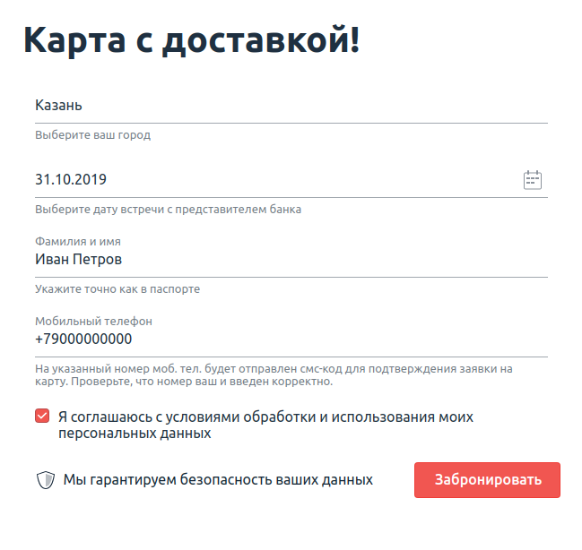
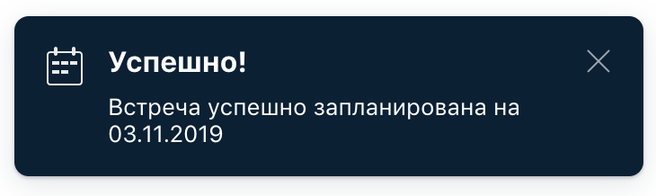

# Домашнее задание к занятию «2.3. Patterns»    

В качестве результата пришлите ссылку на ваш GitHub-проект в личном кабинете студента на сайте [netology.ru](https://netology.ru).

Все задачи по данной теме **обязательны для решения**, задачи необходимо выполнять **в разных репозиториях**.

[Примеры кода для решения задач](https://github.com/netology-code/aqa-code/tree/master/patterns).

**Важно**: проекты с решением задач по данной теме реализуются с использованием Selenide.

**Важно**: если у вас что-то не получилось, то оформляйте issue [по установленным правилам](../report-requirements.md).

**Важно**: не делайте ДЗ всех занятий в одном репозитории. Иначе вам потом придётся достаточно сложно подключать системы Continuous integration.

## Как сдавать задачи

1. Инициализируйте на своём компьютере пустой Git-репозиторий.
1. Добавьте в него готовый файл [.gitignore](../.gitignore).
1. Добавьте в этот же каталог код ваших автотестов.
1. Сделайте необходимые коммиты.
1. Добавьте в каталог `artifacts` целевой сервис: [app-replan-delivery.jar](app-replan-delivery.jar) для первой задачи, [app-ibank.jar](app-ibank.jar) для второй задачи.
1. Создайте публичный репозиторий на GitHub и свяжите свой локальный репозиторий с удалённым.
1. Сделайте пуш — удостоверьтесь, что ваш код появился на GitHub.
1. Выполните интеграцию проекта с Github Actions ([инструкция](../github-actions-integration)) или Appveyor ([инструкция](https://github.com/netology-code/aqa-homeworks/tree/master/api-ci#appveyor)) на выбор, удостоверьтесь что автотесты в CI выполняются.
1. Поставьте бейджик сборки вашего проекта в файл README.md.
1. Ссылку на ваш проект отправьте в личном кабинете на сайте [netology.ru](https://netology.ru).
1. Автотесты могут падать и сборка может быть красной из-за багов тестируемого приложения. В таком случае должны быть заведены репорты на обнаруженные в ходе тестирования дефекты в отдельных issues, [придерживайтесь схемы при описании](../report-requirements.md).

## Настройка CI

Настройка CI осуществляется аналогично предыдущему заданию, за исключением того, что файл целевого сервиса может называться по-другому. Для второй задачи вам также понадобится указать нужный флаг запуска для тестового режима.

## Задача №1: заказ доставки карты (изменение даты)

Вам необходимо автоматизировать тестирование новой функции формы заказа доставки карты:

Требования к содержимому полей, сообщения и другие элементы, по словам заказчика и разработчиков, такие же, они ничего не меняли.

Примечание: личный совет — не забудьте это перепроверить, никому нельзя доверять 😈

Тестируемая функциональность: если заполнить форму повторно теми же данными, за исключением «Даты встречи», то система предложит перепланировать время встречи:

После нажатия кнопки «Перепланировать» произойдёт перепланирование встречи:

**Важно:** в этот раз вы не должны хардкодить данные прямо в тест. Используйте Faker, [Lombok](https://projectlombok.org/setup/gradle), data-классы для группировки нужных полей и утилитный класс-генератор данных — см. [пример](https://github.com/netology-code/aqa-code/blob/master/patterns/patterns-task1/src/test/java/ru/netology/delivery/data/DataGenerator.java).

Утилитными называют классы, у которых приватный конструктор и статичные методы.

Обратите внимание, что Faker может генерировать не совсем в нужном для вас формате.